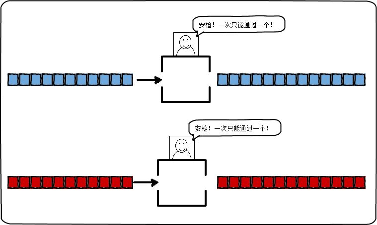
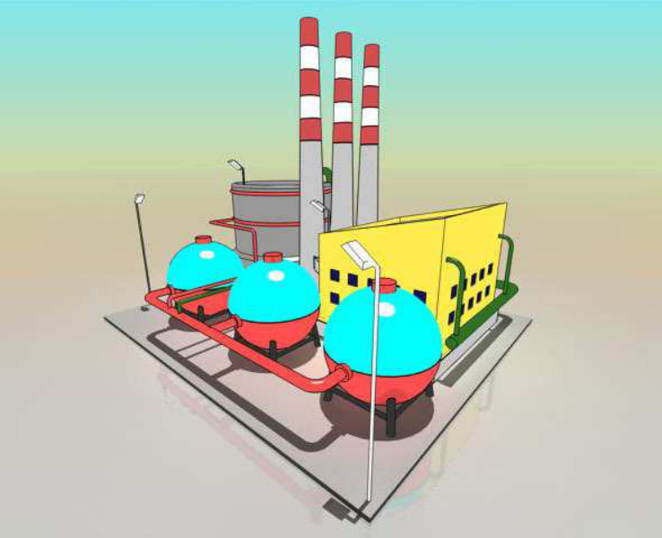
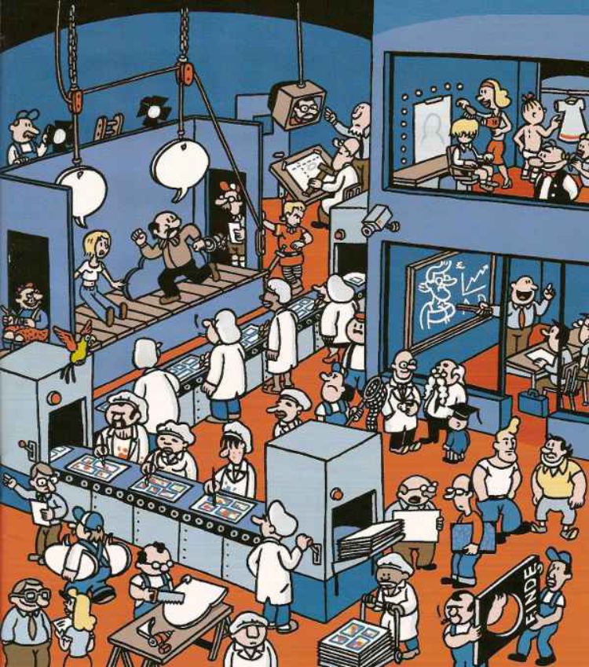
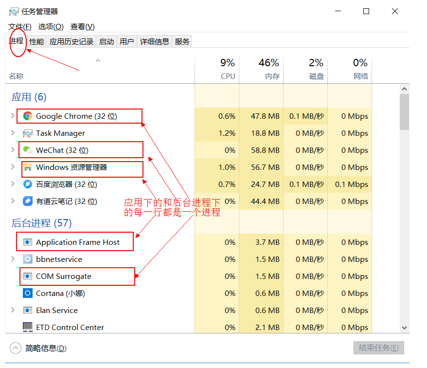
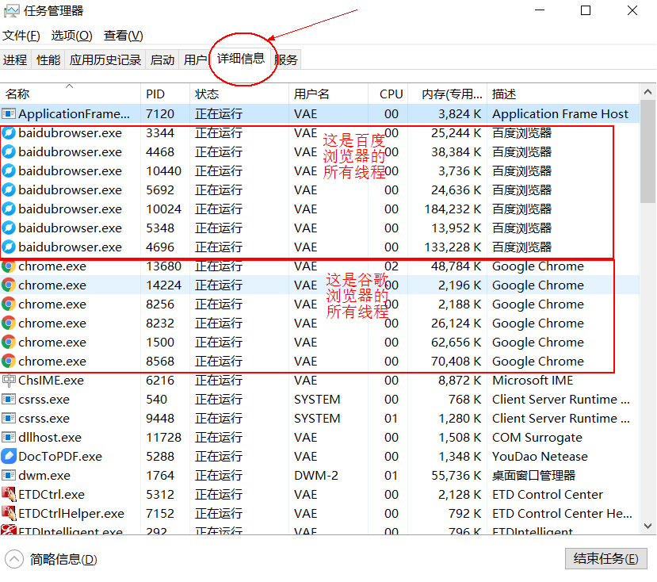

# 多线程

我们在之前，学习的程序在没有跳转语句的前提下，都是由上至下依次执行，那现在想要设计一个程序，边打游戏边听歌，怎么设计？

要解决上述问题,咱们得使用多进程或者多线程来解决.

## 1. 并发与并行

- **并发**：指两个或多个事件在**同一个时间段内**发生。
- **并行**：指两个或多个事件在**同一时刻**发生（同时发生）。



在操作系统中，安装了多个程序，并发指的是在一段时间内宏观上有多个程序同时运行，这在单 CPU 系统中，每一时刻只能有一道程序执行，即微观上这些程序是分时的交替运行，只不过是给人的感觉是同时运行，那是因为分时交替运行的时间是非常短的。

而在多个 CPU 系统中，则这些可以并发执行的程序便可以分配到多个处理器上（CPU），实现多任务并行执行，即利用每个处理器来处理一个可以并发执行的程序，这样多个程序便可以同时执行。目前电脑市场上说的多核 CPU，便是多核处理器，核 越多，并行处理的程序越多，能大大的提高电脑运行的效率。

> 注意：单核处理器的计算机肯定是不能并行的处理多个任务的，只能是多个任务在单个CPU上并发运行。同理,线程也是一样的，从宏观角度上理解线程是并行运行的，但是从微观角度上分析却是串行运行的，即一个线程一个线程的去运行，当系统只有一个CPU时，线程会以某种顺序执行多个线程，我们把这种情况称之为线程调度。

## 2. 线程与进程

计算机的核心是cpu，它承担了所有的计算任务。它就像一座工厂，时刻在运行。


操作系统上运行的每一个应用程序都运行在一个进程中

> **进程**：是指一个内存中运行的应用程序，每个进程都有一个独立的内存空间，一个应用程序可以同时运行多个进程；进程也是程序的一次执行过程，是系统运行程序的基本单位；系统运行一个程序即是一个进程从创建、运行到消亡的过程。

假定工厂的电力有限，一次只能供给一个车间使用。也就是说，一个车间开工的时候，其他车间都必须停工。背后的含义就是，单个CPU一次只能运行一个任务。



进程就好比工厂的车间，它代表CPU所能处理的单个任务。任一时刻，CPU总是运行一个进程，其他进程处于非运行状态。

但实际上很多时候一个程序往往又要"同时"做几件事情，比如我们在进行QQ视频的时候，既可以打字，又能看到视频。其实程

序中分出了多个执行单元来独立完成这几件事情。

一个车间里，可以有很多工人。他们协同完成一个任务。



线程就好比车间里的工人。一个进程可以包括多个线程。

> **线程**：线程是进程中的一个执行单元，负责当前进程中程序的执行，一个进程中至少有一个线程。一个进程中是可以有多个线程的，这个应用程序也可以称之为多线程程序。

简而言之：一个程序运行后至少有一个进程，一个进程中可以包含多个线程

我们可以再电脑底部任务栏，右键----->打开任务管理器,可以查看当前任务的进程：

**进程**



**线程**



**主线程**

任何一个Java程序启动时，一个线程立刻运行，它执行main方法，这个线程称为程序的主线程。

也就是说，任何Java程序都至少有一个线程，即主线程。

主线程的特殊之处在于：

它是产生其它线程子线程的线程；

通常它必须最后结束，因为它要执行其它子线程的关闭工作。

```
public class MainThreadDemo {
	public static void main(String[] args) {
		//输出当前运行的线程，在main方法中，输出的当前运行的线程就是java为当前可执行程序分配的主线程
		//Thread类，是java提供的线程类，里面定义了很多操作线程的方法
		//Thread[main,5,main]   main线程，主线程的一些信息 
		System.out.println(Thread.currentThread());//获得当前执行着的线程
	}
}
```

**线程调度:**

- 分时调度

  所有线程轮流使用 CPU 的使用权，平均分配每个线程占用 CPU 的时间。

- 抢占式调度

  优先让优先级高的线程使用 CPU，如果线程的优先级相同，那么会随机选择一个(线程随机性)，Java使用的为

  抢占式调度。

  - 设置线程的优先级


- 抢占式调度详解

  大部分操作系统都支持多进程并发运行，现在的操作系统几乎都支持同时运行多个程序。比如：现在我们上课一边使用编辑器，一边使用录屏软件，同时还开着画图板，dos窗口等软件。此时，这些程序是在同时运行，”感觉这些软件好像在同一时刻运行着“。

实际上，CPU(中央处理器)使用抢占式调度模式在多个线程间进行着高速的切换。对于CPU的一个核而言，某个时刻，只能执行一个线程，而 CPU的在多个线程间切换速度相对我们的感觉要快，看上去就是在同一时刻运行。
其实，多线程程序并不能提高程序的运行速度，但能够提高程序运行效率，让CPU的使用率更高。


## 3. 创建线程类

Java使用`java.lang.Thread`类代表**线程**，所有的线程对象都必须是Thread类或其子类的实例。每个线程的作用是完成一定的任务，实际上就是执行一段程序流即一段顺序执行的代码。Java使用线程执行体来代表这段程序流。Java中通过继承Thread类来**创建**并**启动多线程**的步骤如下：

1. 定义Thread类的子类，并重写该类的run()方法，该run()方法的方法体就代表了线程需要完成的任务,因此把run()方法称为线程执行体。
2. 创建Thread子类的实例，即创建了线程对象
3. 调用线程对象的start()方法来启动该线程

代码如下：

```
public class Demo01 {
	public static void main(String[] args) {
		//创建自定义线程对象
		MyThread mt = new MyThread("新的线程！");
		//开启新线程
		mt.start();
		//在主方法中执行for循环
		for (int i = 0; i < 10; i++) {
			System.out.println("main线程！"+i);
		}
	}
}
```

自定义线程类：

```
public class MyThread extends Thread {
	//定义指定线程名称的构造方法
	public MyThread(String name) {
		//调用父类的String参数的构造方法，指定线程的名称
		super(name);
	}
	/**
	 * 重写run方法，完成该线程执行的逻辑
	 */
	@Override
	public void run() {
		for (int i = 0; i < 10; i++) {
			System.out.println(getName()+"：正在执行！"+i);
		}
	}
}
```